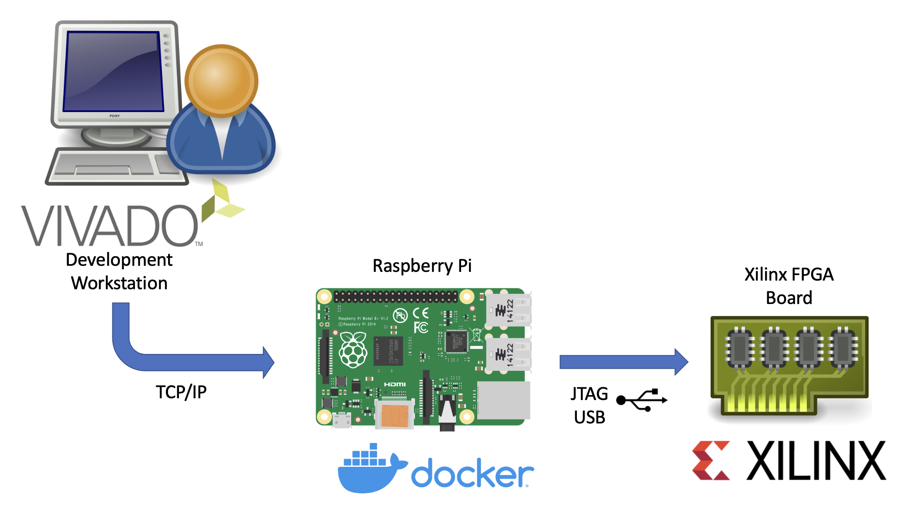

# Xilinx hw_server Docker Image



## Tested Vivado versions

- [v2021.2](https://hub.docker.com/layers/stv0g/hw_server/v2021.2/images/sha256-f313302910f88244cee6593d2a6ffb542b74ff044484c445e83d978b45046cfd?context=explore)

## Tested systems

- Raspberry Pi 4 with 64-bit Raspberry Pi OS (Debian Bullseye)

## Usage

```bash
docker run --rm --restart unless-stopped --privileged --volume /dev/bus/usb:/dev/bus/usb --publish 3121:3121 --detach stv0g/hw_server:v2021.2
```

## Running on non x86_64 systems


```bash
# Install docker
sudo apt-get update && sudo apt-get upgrade
curl -sSL https://get.docker.com | sh

sudo systemctl enable --now docker

# Enable qemu-user emulation support for running amd64 Docker images
docker run --rm --privileged aptman/qus -s -- -p x86_64

# Run the hw_server
docker run --rm --restart unless-stopped --privileged --volume /dev/bus/usb:/dev/bus/usb --publish 3121:3121 --detach stv0g/hw_server:v2021.2
```

## Building your own image

1. Download the _Vivado Lab Solutions_ Linux installer to the current directory.
   - **Do not extract it!**
   - E.g. `Xilinx_Vivado_Lab_Lin_2021.2_1021_0703.tar.gz`
2. Build the image:

```bash
docker build --tag hw_server --build-arg INSTALLER=Xilinx_Vivado_Lab_Lin_2021.2_1021_0703.tar.gz .
```
